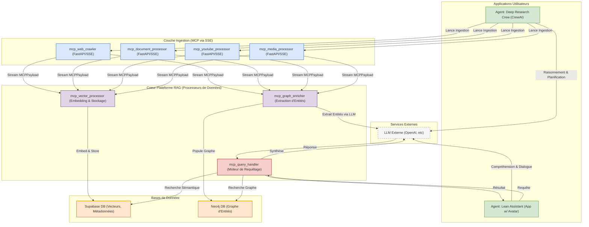

# Architecture Globale de la Plateforme RAG

Ce document présente une vue d'ensemble de l'architecture du projet, illustrant l'interaction entre les différents composants, des agents utilisateurs aux services de traitement et de stockage des données.

